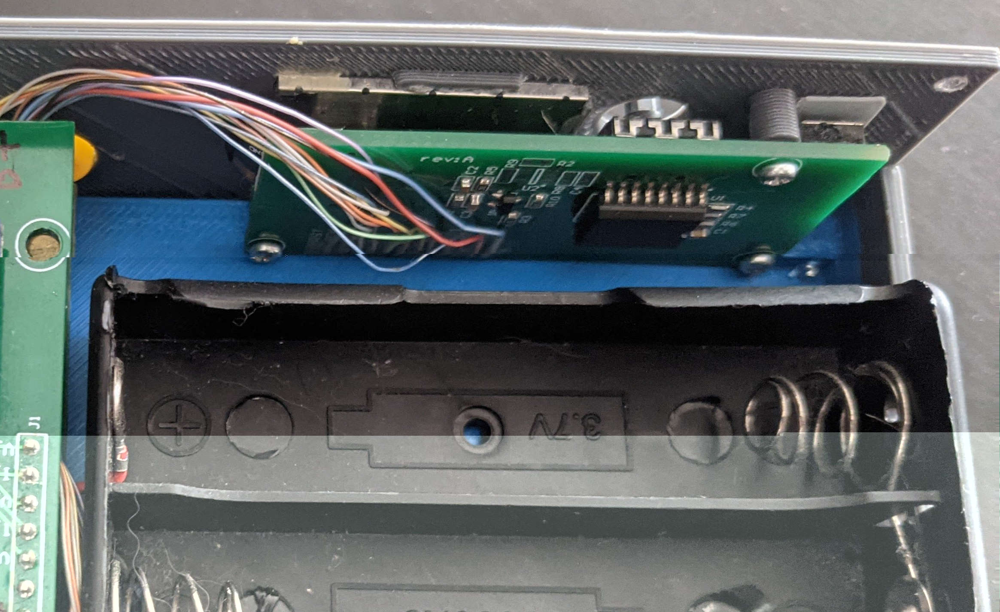

# DPSU

Desk power supply project is intended to develop a compact desk power supply with a dummy load. The power supply can be used to power small devices and perform simple battery capacity test.

---
## Specs

### Power supply

Output: 1.3V - 20V
Output Current: 0A - 1A
Voltage adjustment steps: 100mV
Current adjustment steps: 10mA

### Battery charger

Max charge current: 1A
Battery types: 1S to 4S Li-ion

### Dummy load

Max load: 0.5A
Battery capacity test

---
## Features

* 0.96" Color TFT Screen
* Frontal USB port type A for usb power output
* 1S to 4S Li-ion battery balancer
* Optional supply voltage from internal battery
* Soft power control
* USB serial port available on rear micro usb port type B
* Digital control from tactile keys or serial

---
## Schematics

[Power board](/doc/dpsu_revA_Power_board.PDF) 
[Main board](/doc/dpsu_revA_Main_board.PDF) 
[Front board](/doc/dpsu_revA_Front_board.PDF) 

---
## Images

 

 

 

 

